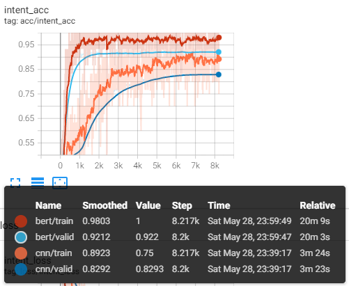
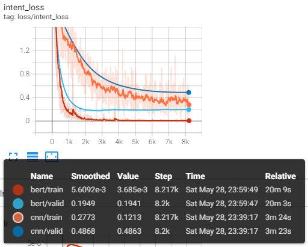
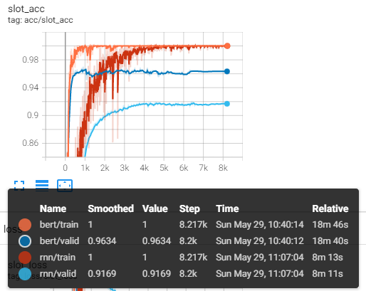
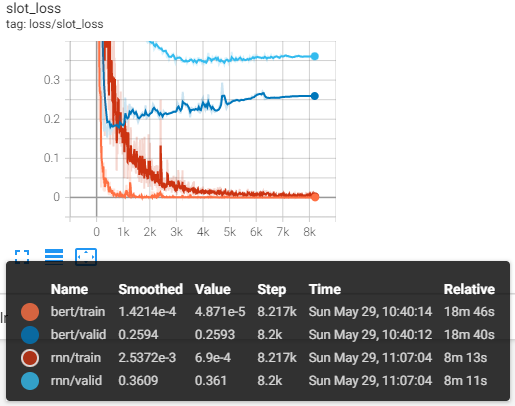
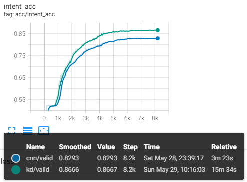
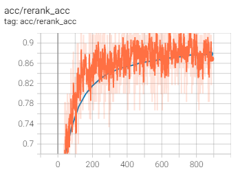
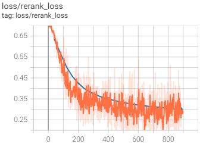

# NLP Transformer研修班

## 项目描述与目标

客服对话系统主要实现了自动与用户进行对话的功能，并且帮助用户完成特定的任务，如订机票、酒店、餐馆等。客服对话系统是任务导向对话系统（Task-oriented Dialogue System）中最广泛的一种应用。
客服对话系统中最重要的两个模块是自然语言理解（NLU）模块和自然语言生成（NLG）模块。
自然语言理解模块的主要作用是将用户所输入的自然语句映射为机器可以理解的结构化数据。这一过程一般会涉及两个子任务：意图识别和槽值检测。意图识别主要通过一个文本分类任务实现，即给定输入query，输出该query所对应的意图。槽值检测过程主要是一个文本序列标注任务，即给定输入query，识别出该query中所携带的关键槽值信息。目前工业界中最常用的解决方案为使用基于Transformer的预训练模型作为文本的特征提取器，然后基于所提取的特征进行文本分类和序列标注，并且在进行序列标注时，一般会添加CRF层进一步提升序列标注的性能。但是在有些应用场景中，我们需要关注系统的时延和效率，而基于Transformer的预训练模型在这种场景中就显得比较笨重，因此有些应用中会将Transformer模型蒸馏到较小的结构中，如CNN/LSTM。
自然语言生成模块的主要作用是生成自然语言回复，主要有两种方式可以实现一个NLG模块：检索式和生成式，检索式的方法会提前建立一个包含问答对的数据库，对于每个问句，我们会匹配该数据库中和输入问句最匹配的回复。而生成式的方法会建立一个问句与答句之间的概率模型，然后在该概率模型中采样相应的答句。在工业应用中，我们一般都会采用基于检索式的NLG模型。检索式NLG模块的实现过程中通常会分成两个步骤，第一个步骤为粗筛，即使用基于BM25的字符串匹配算法（一般使用Elasticsearch实现）召回若干候选回复的集合，减少后续计算的计算量；第二个步骤为精排，即使用基于神经网络的匹配算法将候选回复中最匹配的回复找出来，保证更高的精度。在训练精排模型时，我们通常会使用基于对比学习算法的损失函数优化匹配模型。

## 项目预期结果

本项目主要目的是实现基于Transformer模型的意图分类模块和检索式回复生成模块。
通过本项目的练习，你将掌握如下技能：

1. 使用基于Transformer的预训练模型实现意图识别模块：可以根据用户的输入判断用户的意图，并抽取用户输入中的关键槽值。其中一个意图是闲聊意图。

- 熟练掌握基于CNN/LSTM的文本分类/序列标注模型
- 熟练掌握基于Transformer的预训练模型的微调方法
- 掌握模型蒸馏的方法

2. 使用基于Transformer的预训练模型实现检索式对话模型：可以根据用户的输入，在预定义好的回复库中找到最符合用户输入的回复。实现聊天功能

- 掌握基于Elasticsearch的粗筛模块开发
- 熟练掌握基于Transformer的预训练模型的文本匹配算法

## 项目数据描述

1. NLU模块：SMP2019 ECDT中文人机对话技术测评任务一自然语言理解。包含约2.5K个对话，29个意图和63个槽位。
2. 检索式NLG模块：电商对话数据集（E-commercial Conversation Corpus），包含将近100万个对话Session。每个Session包含约5.51轮对话。

## 项目使用工具

1. Python
2. pytorch
3. Elasticsearch
4. transformers

## 项目安排

本项目会为大家提供代码框架，让大家完整的去了解一个NLP项目的实现流程，并且可以动手实现其中最重要的组件。

## 项目的整个框架

- 数据目录：这一部分包含用于NLU和NLG任务的数据，我们已经提供了预处理好的NLU数据，详见`data/NLU`目录，但是用于NLG项目的数据需要自行下载，详情请见`data/NLG/README.md`。

- NLU模块：这一部分包含一个意图识别模块和槽值检测模块，意图识别模块的主要目的是给定用户输入，识别用户的意图，本质上这一模块是一个文本分类模型，具体的代码实现请见`NLU/intent_cls`这一目录。
槽值检测模块的主要目的是抽取用户输入中的关键槽值，本质上这一模块是一个序列标注模型，具体实现请见`NLU/slot_tagger`这一目录。

- 检索式NLG模块：这一部分包含一个检索式回复生成模块，检索式回复生成模块的主要目的是根据用户输入，在预定义好的回复库中找到最符合用户输入的回复。
其主要步骤有两个，粗筛和精排。粗筛模块一般基于Elasticsearch，具体的代码实现请见 `NLG/retrieve`目录，精排模块一般基于Transformer的预训练模型，具体代码实现请见`NLG/rerank`目录。

## 项目文件说明

### NLU

`intent_cls`和`slot_tagger`目录的结构大体相似，包含如下主要文件：

- `utils.py`：模型训练过程中所需使用到的各类辅助函数
- `train.py`：训练脚本的入口文件，负责解析输入参数，调用模型训练过程
- `model.py`：模型的实现文件，定义了各种模型的实现细节
- `dataset.py`：数据读取部分的实现文件，定义了如何将训练数据转换为Pytorch的输入格式
- `trainer.py`：Trainer的实现文件，定义了训练细节
- `run_training.sh`: 启动分布式训练的脚本

### NLG

`retrieve`目录中包含了基于ES的粗筛模块的实现，主要包含如下文件 (本项目中并不要求实现这一部分的代码，因为这一部分的实现主要依赖于ES，我们只要做调用侠就行了，不属于本次训练营的重点)：

- `build_es_index.py`: 构建ES索引
- `search_in_es.py`: 搜索ES索引

`rerank`目录中包含了基于Transformer的精排模块的实现，主要包含如下文件：

- `utils.py`：模型训练过程中所需使用到的各类辅助函数
- `train.py`：训练脚本的入口文件，负责解析输入参数，调用模型训练过程
- `rerank_model.py`：精排模型的实现文件，定义了各种模型的实现细节
- `dataset.py`：数据读取部分的实现文件，定义了如何将训练数据转换为Pytorch的输入格式
- `trainer.py`：Trainer的实现文件，定义了训练细节
- `run_training.sh`: 启动分布式训练的脚本

## 代码运行环境

代码环境最低运行要求：

- Python > 3.6
- pytorch > 1.11.0
- transformers > 4.0.0

本项目代码在Python3.9, pytorch==1.11.0, transformers==4.19.2中测试通过。

请在开始本项目前安装依赖项：

```bash
pip install -r requirements.txt
```

## TODO List

为了完成以下任务，我们需要逐步熟悉、掌握Pytorch框架，所以请大家在完成每个模块时先查阅一下Pytorch的文档，
弄清楚要实现的模块是做什么的以及如何使用。

- **任务1**：实现基于CNN的意图识别模型，补全`NLU/intent_cls/model.py`文件中的`CNNIntentModule`类。

- **任务2**：实现基于BERT的意图识别模型，补全`NLU/intent_cls/model.py`文件中的`BertIntentModule`类。

至此，你应该已经可以通过指定`NLU/intent_cls/train.py`脚本中的`base_model`选项，训练出一个基于CNN的意图识别模型:

```bash
cd NLU/intent_cls/
python train.py \
    --base_model CNN \
    --save_path {where_to_save_model} \
    --train_file {where_to_find_train_data} \
    --valid_file {where_to_find_valid_data} \
    --intent_label_vocab {where_to_find_intent_label_vocab} \
```

并且可以训练出一个基于BERT的意图识别模型:

```bash
cd NLU/intent_cls/
python train.py \
    --base_model BERT \
    --save_path {where_to_save_model} \
    --train_file {where_to_find_train_data} \
    --valid_file {where_to_find_valid_data} \
    --intent_label_vocab {where_to_find_intent_label_vocab} \
```

注意，训练这两个模型的时候，需要给定正确的数据路径，并且最好指定不同的`save_path`，以便于不同模型的训练结果不会干扰。
我们的脚本模型使用GPU训练，如果你没有GPU，可以修改`NLU/intent_cls/train.py`的第81行，将模型训练过程限定在CPU上。
我们的训练脚本会输出tensorboard日志，你可以预期看到如下训练过程曲线：




- **任务3**：实现基于LSTM的槽值检测模型，补全`NLU/slot_tagger/model.py`文件中的`RNNSlotModule`类。

- **任务4**：实现基于BERT的槽值检测模型，补全`NLU/slot_tagger/model.py`文件中的`BERTSlotModule`类。

至此，你应该已经可以通过指定`NLU/slot_tagger/train.py`脚本中的`base_model`选项，训练出一个基于LSTM的槽值检测模型:

```bash
cd NLU/slot_tagger/
python train.py \
    --base_model RNN \
    --save_path {where_to_save_model} \
    --train_file {where_to_find_train_data} \
    --valid_file {where_to_find_valid_data} \
    --slot_label_vocab {where_to_find_slot_label_vocab} \
```

并且可以训练出一个基于BERT的槽值检测模型:

```bash
cd NLU/slot_tagger/
python train.py \
    --base_model RNN \
    --save_path {where_to_save_model} \
    --train_file {where_to_find_train_data} \
    --valid_file {where_to_find_valid_data} \
    --slot_label_vocab {where_to_find_slot_label_vocab} \
```

注意，训练这两个模型的时候，需要给定正确的数据路径，并且最好指定不同的`save_path`，以便于不同模型的训练结果不会干扰。
我们的脚本模型使用GPU训练，如果你没有GPU，可以修改`NLU/slot_tagger/train.py`的第81行，将模型训练过程限定在CPU上。
我们的训练脚本会输出tensorboard日志，你可以预期看到如下训练过程曲线：




- **任务5**：实现计算知识蒸馏Loss的函数，补全`NLU/intent_cls/trainer.py`文件中的`KDLoss`类。

至此，你应该已经可以通过指定`NLU/intent_cls/train.py`脚本中的`base_model`和`teacher_model`选项，使用数据蒸馏的方法，在`base_model`上达到更好的训练性能:

```bash
cd NLU/intent_cls/
python train.py \
    --base_model CNN \
    --save_path {where_to_save_model} \
    --train_file {where_to_find_train_data} \
    --valid_file {where_to_find_valid_data} \
    --intent_label_vocab {where_to_find_intent_label_vocab} \
    --teacher_model {path_to_a_trained_teacher_model}
```

其中`teacher_model`应该是一个更强的模型，我们的训练脚本会在每个epoch后保存所训练的模型，你可以将`teacher_model`指定为一个已经在我们的NLU数据上训练好的BERT模型。
一般的选择是使用训练好的BERT模型来蒸馏一个CNN模型，或者来蒸馏另外一个BERT模型。
我们的训练脚本会输出tensorboard日志，你可以预期看到如下训练过程曲线：



上图展示了一个用BERT模型蒸馏CNN模型的过程，并且只展示了在验证集上的准确率。可以明显看到，使用了数据蒸馏过程，训练的模型在验证集上的准确率比不使用数据蒸馏的模型要高。

- **任务6**：实现基于BERT的精排模型，补全`NLG/rerank/rerank_model.py`文件中的`RerankModule`类。

至此，你应该已经可以通过`NLG/rerank/train.py`脚本，训练出一个基于BERT的精排模型:

```bash
cd NLG/rerank/
python train.py \
    --save_path {where_to_save_model} \
    --train_file {where_to_find_train_data} \
    --valid_file {where_to_find_valid_data} 
```

我们的训练脚本会输出tensorboard日志，你可以预期看到如下训练过程曲线：



