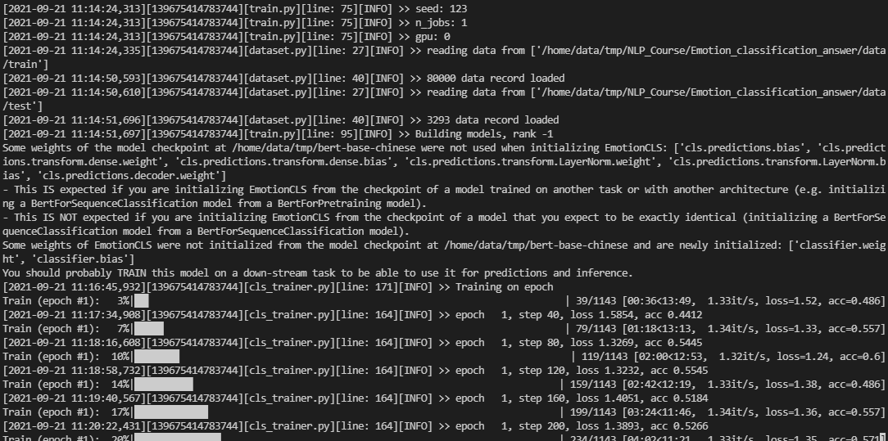
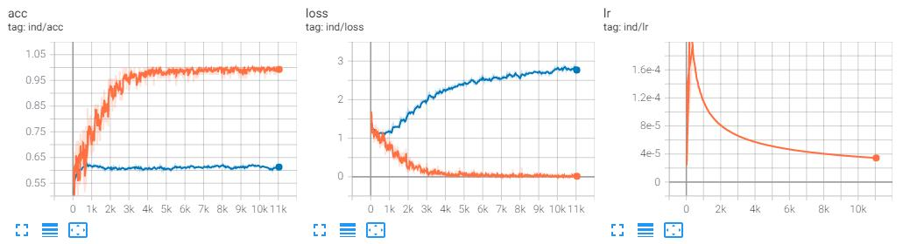

# NLP研修班-预训练项目

# 项目描述与目标

本项目主要目的是基于BERT实现基于文本的情感分析模型。通过本项目的练习，你能掌握**基于预训练模型的文本分类算法**的主要实现流程：

- 文本预处理：整理情感标签。由于本项目主要基于现有的预训练模型进行微调，因此本项目不需要自己准备词表和Tokenizer。
本项目还会带领学员实现自己的Dataset，从而可以让模型适用于各种不同的输入文件格式。

- 模型搭建：近些年深度学习的模型迭代很快，很多模型提出后还未被 工业界广泛应用，因此不像经典的机器学习模型如逻辑回归、随机森
林等有成熟的实现方案。很多时候我们需要自己去阅读论文之后，根 据论文以及作者提供的代码去复现（reproduce）一个模型，并且结合
到我们的业务需求和数据进行调整。我们将详细解释如何构建一个深 度学习模型的各个模块，包括实现前向传导、定义损失函数等。模型
的搭建将是本项目最重要的一个部分。

- 模型训练：在实际的应用中，除了实现模型本身，另外的一项重要任务是实现训练流程中的细节，比如，如何输入数据，如何使用反向传播计算梯度，
如何更新模型参数，如何保存模型以及如何评测模型。本项目将会带领学员实现这些细节。

同时，通过本项目，学员将会掌握如下的技能：

- 熟练掌握基于BERT的文本分类模型原理
- 熟练掌握如何使用Pytorch框架搭建神经网络结构
- 熟练掌握Pytorch中的数据处理流程
- 熟练掌握如何训练神经网络
- 掌握深度学习训练的一些优化技巧

# 项目数据描述

在本项目中，我们使用的是来自于微博的情感分类数据集。这些数据可以在`data`文件夹中找到。
原始样本包含8万条文本，每条文本包含一个句子，每个句子被标记有一个情感标签。

# 项目安排

本项目会为大家提供代码框架，让大家完整的去了解一个NLP项目的实现流程，并且能够自己实现一个文本分类模型。

## 项目的整个框架

- 文本预处理：这一部分不需要太多的工作量，因为我们的项目主要基于现有的预训练模型进行微调，因此本项目不需要自己准备词表和Tokenizer。
在这一部分中，学员需要实现脚本从训练数据中提取情感标签集合，并将其保存在一个输入文件中。
并需要实现一个Dataset类将训练数据转换为可适用于Pytorch框架的输入。

- 模型搭建：我们将使用Pytorch框架，并基于transformers库构建基于BERT的文本分类模型。在这一部分，学员需要实现模型的搭建，包括：
使用BERT得到输入序列的表示，在序列表示向量的基础上定义线性分类器实现情感分类。

- 模型训练：在这一部分，学员需要实现训练流程，包括：
分类loss的计算，反向传播计算梯度，模型参数的更新，模型的保存和评测。

## 项目文件说明

- `data/train`：训练数据，包含8万行文本，每行文本使用换行符分割为两列，第一列为情感标签，第二列为句子。如果需要开发集，需要从这一文件中自己提取。
- `data/test`：测试数据
- `utils.py`：模型训练过程中所需使用到的各类辅助函数
- `train.py`：训练脚本的入口文件，负责解析输入参数，调用模型训练过程
- `optim.py`：Adam优化器的实现脚本，从Pytorch的官方实现中拷贝过来
- `model.py`：模型的实现文件，定义了基于BERT的文本分类器的实现细节
- `dataset.py`：数据读取部分的实现文件，定义了如何将训练数据转换为Pytorch的输入格式
- `cls_trainer.py`：Trainer的实现文件，定义了训练细节

## TODO List

为了完成以下任务，我们需要逐步熟悉、掌握Pytorch框架，所以请大家在完成每个模块时先查阅一下Pytorch的文档，
弄清楚要实现的模块是做什么的以及如何使用。

### 文本预处理

- **任务1**：实现脚本构建情感标签词表，将其保存在文件`label_vocab`中，并将文件`label_vocab`放置在`data/`目录下。
`label_vocab`中应该包含所有去重之后的情感标签，每一行为一个标签。

- **任务2**：完成`dataset.py`文件中的`EmotionDataset.make_dataset`函数，将输入数据文件全部读取到内存中。
这一函数的返回值为一个列表，列表中的每个元素为一个`(label, utterance, mask)`元组，其中：

1. `label`为情感标签。

2. `utterance`为句子中token所对应的id序列。
并且这一id序列满足BERT模型的输入要求，即：`[CLS] + tokens + [SEP]`

3. `mask`是和`utterance`等长的，元素全部为1的序列。

- **任务3**：完成`model.py`文件中的`EmotionCLS.forward`函数，实现分类器模型的前向传播。
分类器模型的前向传播过程为：

1. 使用BERT，将输入序列编码为`(batch_size, seq_len, hidden_size)`的形式，其中`hidden_size`为BERT模型的隐藏层维度。

2. 获取`[CLS]`位置的表示。

3. 对`[CLS]`位置的表示施加dropout。

4. 在施加了dropout操作之后的表示上进行线性变换，得到`(batch_size, num_labels)`形状的表示向量，即分类的`logits`。

5. 如果函数输入中`labels`不为`None`，则计算分类的交叉熵损失`loss`。

6. 如果函数输入中`labels`为`None`，则将分类的交叉熵损失`loss`设为`None`。

- **任务4**：完成`cls_trainer.py`文件中的`_eval_train`函数，实现训练过程。

模板如下：

```python
# Forward pass
_, logits = self.model(text, attention_mask=mask)
# Calculate loss
batch_loss = self.criterion(logits, label)
# Calculate acc
batch_acc = # TODO
# Rescale the loss
full_loss = batch_loss / self.config.batch_split
# Backward pass
full_loss.backward()
# Get current step and lr
curr_step = self.optimizer.curr_step()
lr = self.optimizer.param_groups[0]["lr"]
# Implement batch split trick
if (i + 1) % self.config.batch_split == 0:
    # Update weights
    self.optimizer.step()
    self.optimizer.zero_grad()
    # Log out losses and accuracies
    # TODO
    # Do evaluate of the model on the DEV set.
    if curr_step % self.config.eval_steps == 0:
        # Call the `_eval_test` function to test the model on the DEV set.
```

需要注意的是，上述代码中，我们需要在`_eval_train`函数中计算训练loss和accuracy。
并且如果大家需要实现并行训练代码的话，只需在主进程中打印loss和accuracy即可。并且上述模板中实现了batch split的技巧，
即使用多个batch的数据所计算出来的梯度统一更新模型参数。

- **任务5**：完成`cls_trainer.py`文件中的`_eval_test`函数，实现在开发集上的测试过程。

模板如下：

```python
loss, acc = 0, 0
for d_data in self.valid_dataloader:
    # Calcuate the loss and accuracy for each batch
    batch_loss = # TODO
    batch_acc = # TODO
    loss += batch_loss
    acc += batch_acc
# Average the loss and accuracy
loss /= len(self.valid_dataloader)
acc /= len(self.valid_dataloader)
# Log out the loss and accuracy
# TODO
```

如果确认前面的模块实现无误，可以使用如下指令训练你的模型，在模型训练之前，
需要先下载huggingface所提供的[bert-base-chinese](https://huggingface.co/bert-base-chinese/tree/main)预训练模型。
并将下载好的预训练模型权重文件`pytorch_model.bin`，配置文件`config.json`，词表文件`vocab.txt`，`tokenizer.json`，`tokenizer_config.json`放置在同一个目录下。

```bash
python train.py \
--bert_path  [path to downloaded pre-trained model] \
--save_path [path to save the resulting model] \ 
--train_file [path to the training data file] \
--valid_file [path to the validation data file] \ 
--label_vocab [path to the emotion label vocab file]
```

示例输出：



Tensorboard:


